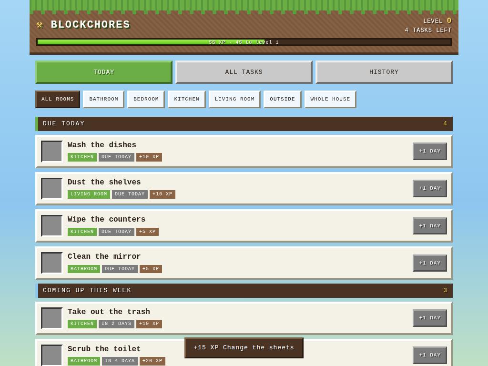

# BlockChores

A household cleaning schedule for the family iPad, built to run on **Safari on a
1st generation iPad mini (iOS 9)** — and styled like Minecraft: sky blue, grass
green, dirt brown and white, with an XP bar you fill by cleaning.



## What it does

- **Recurring tasks.** Every N days, chosen weekdays, a day of the month, or a
  one-off. The clock restarts from the day you actually check something off, so
  a task done late doesn't stay permanently out of step.
- **Today dashboard.** Overdue, due today, coming up this week, and everything
  you already finished today — each with a big tappable check box.
- **Undo and snooze.** Check something off by mistake, tap it again. Not getting
  to it today? Push it a day.
- **XP, levels and streaks.** Every task is worth XP; finishing them levels you
  up and builds a per-task streak.
- **Rooms.** Filter the dashboard by Kitchen, Bathroom, Outside, or whatever you
  make up.
- **Shared across devices.** State lives on the server, and every iPad refreshes
  itself each minute, so two people checking things off stay in sync.

## Running it

No dependencies beyond Python 3 — nothing to `pip install`.

```sh
git clone https://github.com/brandonbrower01-blip/cleaning-schedule.git
cd cleaning-schedule
python3 server.py --port 8080
```

Then open `http://<server-ip>:8080/` on the iPad. The first run seeds a starter
list of chores you can edit or delete.

Options:

| Flag | Default | Meaning |
| --- | --- | --- |
| `--host` | `0.0.0.0` | Address to bind |
| `--port` | `8080` (or `$PORT`) | Port to listen on |
| `--data` | `./data` | Directory (or `.json` path) for the data file |

## Installing on Debian 13

```sh
sudo sh deploy/install.sh
```

That copies the app to `/opt/blockchores`, installs
`deploy/blockchores.service`, and starts it on port 8080. The service runs under
a systemd `DynamicUser` with its data in `/var/lib/blockchores` — no user
account to create, nothing writable outside that directory.

```sh
systemctl status blockchores      # is it up
journalctl -u blockchores -f      # watch the log
```

If you want it on port 80 or behind a name like `http://chores.lan/`, there's an
nginx site in `deploy/nginx-blockchores.conf`.

Allowing the iPad through the firewall, if you run one:

```sh
sudo ufw allow from 192.168.0.0/16 to any port 8080 proto tcp
```

### Backups

Everything is one JSON file, so a backup is a copy:

```sh
sudo cp /var/lib/blockchores/chores.json ~/chores-backup-$(date +%F).json
```

The server also keeps the previous version as `chores.json.bak` after each write.

## On the iPad

Open the page in Safari, tap the share button, and choose **Add to Home Screen**.
It then launches full screen with the grass-block icon and no browser chrome.

Because that iPad is stuck on iOS 9, the front end is written for it on purpose:

- ES5 only — no arrow functions, `let`/`const`, template strings, `fetch` or
  promises. Requests go through `XMLHttpRequest`.
- No CSS grid, no custom properties, no `position: sticky`; layout is flexbox
  with `-webkit-` prefixes, and gradients use the old multi-stop syntax.
- Taps are handled on `touchend` so buttons respond immediately instead of
  waiting out Safari's 300ms click delay.
- Inputs are 16px so focusing a field doesn't zoom the page.
- The last good state is cached in `localStorage`; if the server is unreachable
  the app still shows the most recent list with a warning banner.

## API

Small JSON API, same origin, no auth — it is meant for a home network. Every
write returns the complete new state so the UI never has to guess.

| Method | Path | Body |
| --- | --- | --- |
| `GET` | `/api/state` | — |
| `POST` | `/api/tasks` | task fields |
| `POST` | `/api/tasks/<id>` | task fields (update) |
| `POST` | `/api/tasks/<id>/delete` | — (`DELETE /api/tasks/<id>` also works) |
| `POST` | `/api/tasks/<id>/complete` | `{"date": "YYYY-MM-DD"}` (optional) |
| `POST` | `/api/tasks/<id>/undo` | — |
| `POST` | `/api/tasks/<id>/snooze` | `{"days": 1}` |

A task looks like this:

```json
{
  "name": "Scrub the toilet",
  "area": "Bathroom",
  "assignee": "",
  "notes": "",
  "points": 20,
  "recurrence": {"type": "weekly", "days": [6]},
  "start": "2026-09-22"
}
```

`recurrence.type` is one of:

| Type | Fields | Example |
| --- | --- | --- |
| `days` | `every` | `{"type": "days", "every": 3}` |
| `weekly` | `days` (0 = Sunday) | `{"type": "weekly", "days": [1, 4]}` |
| `monthly` | `day` (1–31, clamped in short months) | `{"type": "monthly", "day": 1}` |
| `once` | `date` | `{"type": "once", "date": "2026-10-01"}` |

Anything the browser sends is normalised server-side, so a bad `every` or an
out-of-range weekday can't corrupt the file.

## Tests

```sh
python3 -m unittest discover tests
```

Covers the recurrence maths (including month-end clamping and leap years),
completion/undo/snooze round trips, persistence across a restart, and the HTTP
API end to end.

## Layout

```
server.py                  the whole backend: recurrence, storage, HTTP
static/index.html          app shell
static/css/style.css       the Minecraft theme
static/js/app.js           ES5 front end
tools/make_icon.py         draws the grass-block icons (stdlib PNG writer)
tests/test_server.py       unit + API tests
deploy/                    systemd unit, nginx site, installer
```
